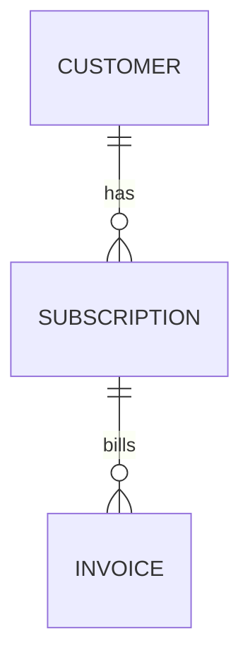
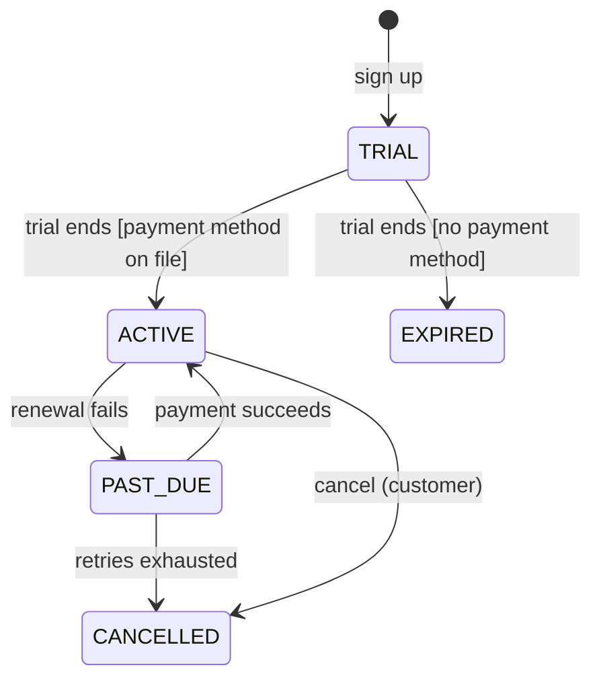

# Subscription service

## Data model

```mermaid
erDiagram
    CUSTOMER ||--o{ SUBSCRIPTION : has
    SUBSCRIPTION ||--o{ INVOICE : bills
```

## Subscription lifecycle

```mermaid
stateDiagram-v2
    [*] --> TRIAL : sign up
    TRIAL --> ACTIVE : trial ends [payment method on file]
    TRIAL --> EXPIRED : trial ends [no payment method]
    ACTIVE --> PAST_DUE : renewal fails
    PAST_DUE --> ACTIVE : payment succeeds
    PAST_DUE --> CANCELLED : retries exhausted
    ACTIVE --> CANCELLED : cancel (customer)
```
